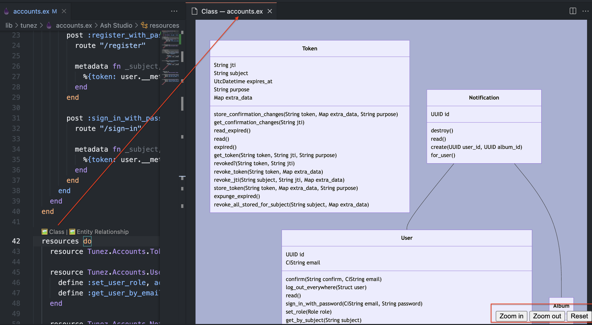

# Ash Studio VS Code Extension

Working with Ash Framework projects often means dealing with long resource files, making it hard to
find and navigate between sections.

Ash Studio is a VS Code extension that solves this by providing navigation and code insight tools,
helping you quickly jump between Ash DSL sections and understand your code structure at a glance.

## ✨ Features

- **🧭 Smart Navigation** - Jump between Ash sections with document outline integration
  

- **⚡ Quick Section Search** - Instantly find and navigate to any Ash section via Command Palette
  

- **📊 Sidebar Overview** - Dedicated panel showing all Ash sections and their hierarchy
  

- **📚 Mermaid Diagram Code Lenses** - CodeLens provides direct viewing of mermaid diagrams
  

## 📦 Installation

### From Your Extensions Store

1. Search for Ash Studio or
   - [VS Code Marketplace](https://marketplace.visualstudio.com/items?itemName=ketupia.ash-studio)
   - [Open VSX (Windsurf/Cursor)](https://open-vsx.org/extension/ketupia/ash-studio)
2. Click install

### From VSIX File

1. Download the latest `ash-studio-x.x.x.vsix` file
2. Open VS Code
3. Go to Extensions panel (Ctrl+Shift+X / Cmd+Shift+X)
4. Click the "..." menu → "Install from VSIX..."
5. Select the downloaded `.vsix` file
6. Reload VS Code when prompted

### Requirements

- VS Code 1.75.0 or higher
- Ash Framework project with `.ex` files using `Ash.Resource` or `Ash.Domain`

## 🚀 Getting Started

1. **Open an Ash Project**: Open any folder containing Ash Framework `.ex` files
2. **Open Ash Files**: The extension activates when you open files with `use Ash.Resource` or
   `use Ash.Domain`
3. **Explore Features**:
   - **Sidebar Panel**: Look for "Ash Studio" in the Explorer sidebar
   - **Document Outline**: View Ash sections in VS Code's Outline panel
   - **Quick Navigation**: Use `Cmd+Shift+P` → "Go to Ash Section..."
4. Consider adding some version of this to your .gitignore if you don't want diagrams saved in your
   repo.

```gitignore
lib/**/*.mmd
```

## 🎯 Usage

### Navigation and Diagram Features

> ⚠️ **Note:** Unusual behavior might occur on malformed source. A full Elixir parser has not been
> implemented, and testing has been performed on well-formed files.

**Sidebar Navigation**

- View all Ash sections organized by type (attributes, actions, relationships, etc.)
- Click any section to jump directly to it in the code
- Hierarchical view shows section details and nested elements

**Quick Pick Navigation**

- Press `Cmd+Shift+P` (Ctrl+Shift+P on Windows/Linux)
- Type "Go to Ash Section" or just "ash"
- Select any section for instant navigation

**Document Outline**

- Use VS Code's built-in Outline panel
- See all Ash sections as navigable tree structure
- Click to jump to any section

**CodeLens Mermaid Diagram Links**

- Click on CodeLens links to open the mermaid diagram in a webview. Diagrams will be created using
  mix tasks.
  > ⚠️ **Note:** Your project needs to compile to generate diagrams.
- Choose the diagram format in settings.

### Supported Ash Constructs

#### Core Ash Framework

The extension recognizes and navigates these core Ash DSL sections:

- **Resources**: `resource`, `attributes`, `actions`, `relationships`, `calculations`, `aggregates`,
  `policies`, `code_interface`
- **Domain**: `resources`
- **PubSub**: `pub_sub`

#### Ash Ecosystem Libraries

The extension also supports DSL sections from selected core and community Ash libraries:

- **AshAdmin**: `admin`
- **AshAuthentication**: `authentication`, `strategies`
- **AshGraphql**: `graphql`
- **AshJsonApi**: `json_api`
- **AshPaperTrail**: `paper_trail`
- **AshPostgres**: `postgres`
- **AshJason**: `jason`
- **AshOutstanding**: `outstanding`
- **AshNeo4j**: `neo4j`

## 🐛 Troubleshooting

**Extension not activating?**

- Ensure your `.ex` files contain `use Ash.Resource` or `use Ash.Domain`
- check the Ash Studio channel in the Output window for errors

## 💬 Support & Feedback

- **Issues**: [GitHub Issues](https://github.com/ketupia/ash-studio-vscode-extension/issues)
- **Feature Requests**: Use GitHub Issues with "enhancement" label
- **Questions**: Start a
  [GitHub Discussion](https://github.com/ketupia/ash-studio-vscode-extension/discussions)
